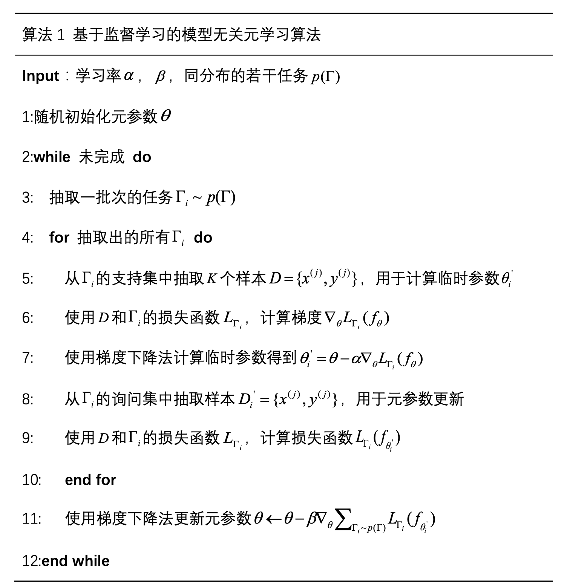
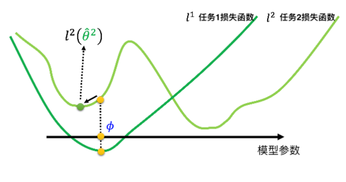
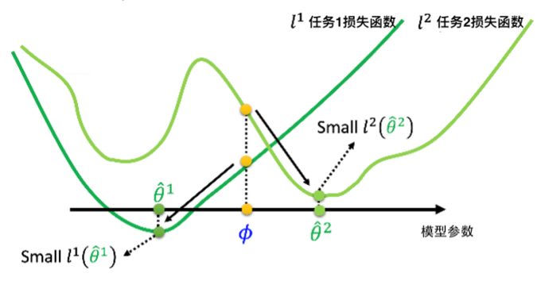

###### [返回主页](../README.md)

------

# 模型无关的元学习方法 

## 一、元学习方法概述

元学习是一种实现小样本学习的方法，其核心思想有别于其他小样本学习方法，元学习的目标是使得机器学会“如何去学习”，即模型本身具有快速学习能力。元学习方法在图像分类任务中应用广泛，并取得了显著的成果，因此元学习在目标检测任务中具有极大潜力。

机器学习算法具有能有拟合待解决任务的能力，而元学习与传统机器学习有所不同，元学习算法并不侧重于单一任务的拟合，而是侧重学习如何去学习侧重于学习能力本身。元学习的远期目标为通过类似人类的学习能力实现强人工智能。人类在掌握一些基础技能后可以快速学习并适应新任务，儿童阶段的人类也可以快速通过一张某动物照片学会认出该动物，即机器学习中的小样本学习。当前阶段体现在对新数据集的快速适应带来较好的准确度，因此目前元学习主要表现为提高泛化性能、获取好的初始参数、通过少量计算和新训练数据即可在模型上实现和海量训练数据一样的识别准确度。

## 二、MAML原理

一些元学习算法是为某一大类学习任务而设计不具有通用性，Chelsea Finn 等人提出了一种模型无关的元学习算法（MAML）可以被用于任何通过梯度下降优化的模型。

MAML是当前元学习的不同探索方中比较有潜力的分支，且己有众多后续基于 MAML 的改进，如结合隐空间Relation Network、Residual Network、贝叶斯先验、优化梯度下降过程等方法，将模型在mini ImageNet 数据集上单样本学习识别准确率从48.7%提升至 62%. 同时由于MAML 的开放性与灵活性，也可用于一系列基于梯度下降训练的模型，包括分类、回归、强化学习等，因此叫做模型无关元学习模型。

具体地，在监督学习问题中，MAML算法的训练样本和测试样本为若干同分布的监督学习任务，每个监督学习任务也具有自身的训练集和测试集，分别称为支持集（support set）和询问集（query set）。训练目标是得到具有适应新任务能力的元参数。训练过程被分为内外两部分，使用支持集和询问集优化一个任务为内层训练，使用一批任务优化元参数为外层训练。

在内层训练中，使用支持集样本对当前元参数进行梯度下降，得到临时参数，该过程为元训练过程；再使用询问集样本，和临时参数计算损失，得到内层损失，该过程为元测试过程。

在外层训练中，累加一批次的的内层损失，使用梯度下降法，更新元参数。

具体算法流程如下：

## 三、元学习VS迁移学习

迁移学习中的预训练-微调的训练方式，也可一定程度的保留先验知识，也可适应新任务，但其与元学习的MAML算法有着不同的侧重点。

上图中曲线为与训练-微调的模型损失示意图，深绿色为预训练损失曲线，当前模型参数已经达到最优点，此时在少量新样本下进行微调，由于数据量不足极易导致模型向局部最优方向更新，如图中浅绿色曲线所示。这是由于训练参数处于拟合预训练任务的最佳状态，并不是最适合小样本新任务的最佳状态。

元学习可以很好的解决此问题，上图中曲线为的元学习模型损失示意图，训练好的参数，处于兼顾多种任务的最佳状态，可以更快适应小样本新任务，只需要很少次梯度下降，即可将模型更新至适合新任务的全局最优处，实现小样本学习。
