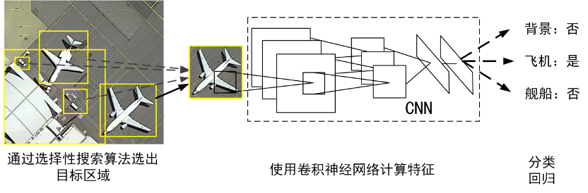
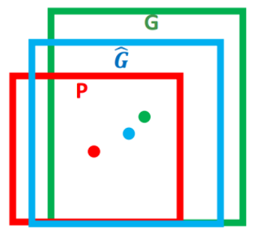
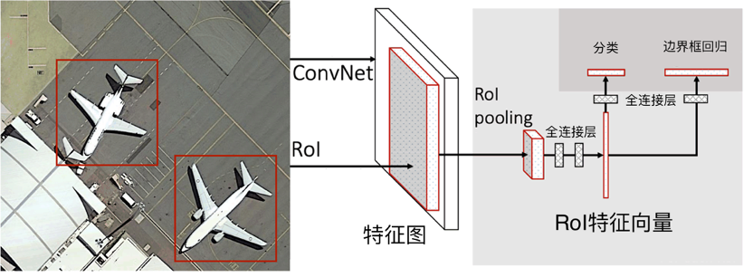
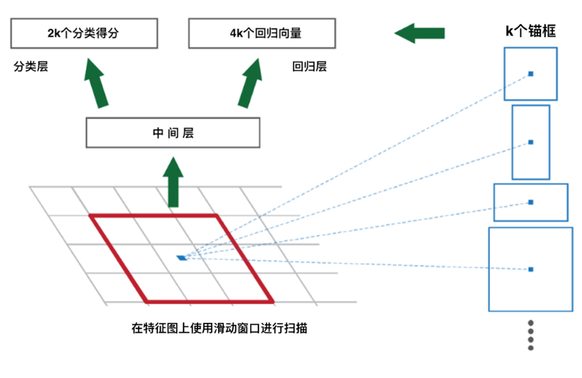
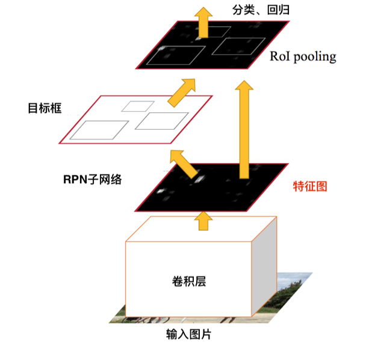

###### [返回主页](../README.md)

------

# 经典目标检测方法：RCNN系列

## RCNN

RCNN作为基于深度学习的目标检测开篇之作，将卷积神经网络巧妙的应用到了目标检测领域，该方法首先使用选择性搜索算法从输入的图片中选出候选区域，再将这些候选区域送至卷积神经网络进行特征提取，最后将提取出的特征送入SVM分类器以及回归器，得到类别和位置坐标。RCNN结构如图所示：

其中边界框使用四位向量描述，边界框中心点坐标x, y、边界框宽w以及边界框高h。下图中红色框P代表候选区域，绿色框G代表真实框。回归器的目标是寻找一种对应关系，使得输入候选框P经过映射得到与真实框G更接近的回归框G^。

## Fast-RCNN

RCNN的检测流程中，需要多次执行卷机神经网络前向传播运算，因此计算量较大，检测过程缓慢，模型的训练也比较复杂。Fast RCNN可以有效的解决上述问题，其网络结构如下图所示。

该方法先对整张图使用卷机神经网络进行特征提取，然后使用选择性搜索算法提取感兴趣区域（RoIs）形成候选框。之后，对感兴趣区域进行池化，得到尺寸相同的候选区域，这样，相当于只在原始图像上做一遍卷机操作，就得到了和RCNN类似的候选框。同时该方法也将分类器和回归器集成到了网络中，使得算法更具有整体性。

## Faster-RCNN

虽然Fast RCNN已经具有一定的整体性了，但是其特征提取部分，依然还是独立的一部分，因此为了实现检测网络端到端的训练，Faster RCNN中提出了区域提案网络（Region Proposal Network，RPN），RPN共享卷机神经网络提取出的特征，在特征上，以每个特征点为中心，用3*3矩形窗口进行扫描，判断是否有物体时先将窗口按比例换算回原图进行判断，在换算回原图时采用多种尺寸和长宽的窗口（也被称作锚框）比来防止漏检现象。除了判断该窗口是否包含物体，RPN子网络还会回归出一组锚框的粗调整参数。若特征中包含k个窗口，则RPN子网络的结果会包含2k个分类结果（前景或背景），和4k个回归向量，RPN子网络示意图如下图所示。

Faster RCNN在引入RPN网络后，可以实现端到端的训练，大大减轻了模型训练的负责程度，基于神经网络的候选区域生成方法也取代了人工定义的候选区域生成方法。Faster RCNN的完整网络结构如下图所示。

