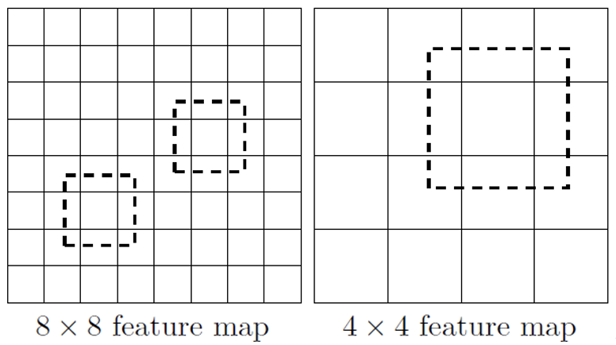
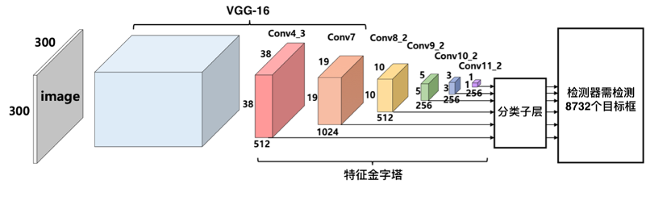
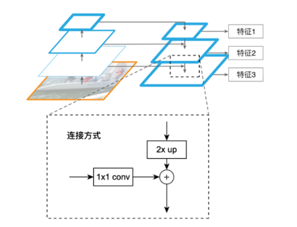
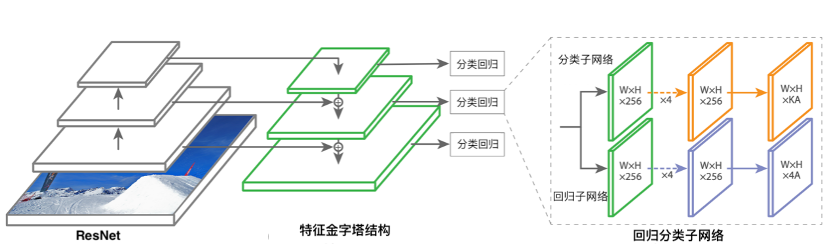
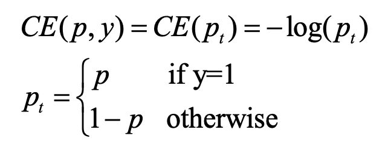
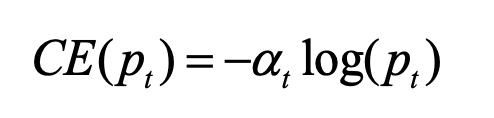
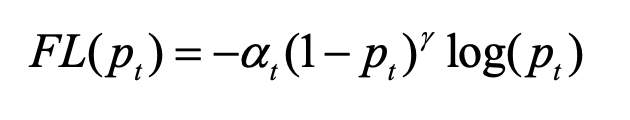

###### [返回主页](../README.md)

------

# 经典目标检测方法：SSD & RetinaNet

## SSD

基于深度神经网络的目标检测器大致可分为两大类，单阶段检测器和双阶段检测器，上文提到的Faster RCNN属于双阶段目标检测器，其检测过程分两步进行，首先在根据图片的特征生成若干锚框，其次再对这些候选的锚框进行分类回归，更侧重检测精确度。而单阶段的检测器，是在图片的特征上直接进行分类和回归，整个检测过程只需要一步，更侧重检测的速度。同时单精度检测器一般结构简单，具有较强的扩展性。SSD（Single Shot MultiBox Detector）方法是经典的单阶段目标检测器，该方法考虑到了目标检测问题中小目标经常被落检的问题，

采用多尺度的特征图用于检测，对主干网VGG-16最后6个卷积层输出的不同尺寸特征图都进行检测，其中比较大的特征图来用来检测相对较小的目标，而小的特征图负责检测大目标，如下图所示，8x8的特征图可以划分更多的单元，但是其每个单元的锚框尺度比较小。

SSD算法会在不同尺度的特征图的每个特征点生成一组锚框，锚框长宽比为1:1、1:2、1:3、2:1以及3:1，为了提升对这些锚框的检测速度，该方法将分类回归子网络的全连接层改为全卷积层，原先全连接网络最后一层输出节点数对应全卷积网络卷积核的通道数，将卷积结果相同位置不同通道的值组成的向量作为该位置的分类或回归结果。利用卷积运算的性质，实现类似滑动窗口的检测方式。

最终在得到多尺度、多尺寸锚框的分类回归结果后，使用非极大值抑制算法汇总检测结果，该方法对大小目标都有良好的检测性能，提升了召回率。其基本框架如下图所示：

## FPN

检测尺寸差别很大的物体是计算机视觉所面临的基本挑战之一。在图像处理中，使用图像金字塔解决多尺度的问题，因此在卷积神经网络中也可以引入这种思路，使用多尺度特征。SSD虽然使用了多尺度的特征，但为了避免混入底层特征，只是在网络的高层加入卷机层实现多特征结构，因此，SSD并没有合理利用低层高分辨的特征图，即没有充分利用到低层特征图中的空间信息，而这些信息对小物体的检测十分重要。

而特征金字塔网络FPN可以充分利用多尺度特征，其结构具有两个主要部分：第一个是自下而上的特征提取通路，用于逐层获取高层特征；第二个是自上而下的特征融合通路，用于将小尺寸的高层特征上采样后融合到低层特征图上。经过FPN两个通路的计算后，可以得到由小尺寸的高层特征以及大尺寸的融合了高层语义的低层特征构成的特征金字塔，充分利用了各个尺寸特征，兼顾了检测场景中目标的各种尺寸。检测器同时使用特征金字塔的每一层进行检测，其中大尺寸的特征图位于金字塔的低层，能够保留更多细节特征，且感受野相对小更适合检测小目标；小尺寸特征图位于特征金字塔的高层，其特征干扰信息较少更加抽象和鲁棒，且感受野相对更大更适合检测大目标。因此在设置锚框时，金字塔由低到高，锚框基础尺寸依次增大。检测的最终阶段汇总各层的预测框，通过非极大值抑制等方法进行后处理，筛选出置信度高的若干预测框作为检测器的检测结果。与直接使用卷积神经网络不同尺寸的特征图相比，特征金字塔网络将高层特征图上采样后与低层特征图相加，使得低层特征具有细节信息的同时带有了高层语义，有效解决了低层特征图抽象程度低，检测效果不理想的问题。

## RetinaNet

RetinaNet是由何凯明等人于2017年提出的全新单阶段目标检测器，该检测器在保证检测质量的同时，也具有较快的检测速度。RetinaNet作为典型单阶段水平目标检测器，由一个特征提取主干网络和两个检测子网络组成。特征提取主干网负责计算整个输入图像的特征图，分类子网络根据特征图来预测目标类别，回归子网络根据特征图来预测边界框位置，其结构如下图所示。

RetinaNet使用具有残差结构的ResNet作为特征提取主干网，为了适应目标检测任务中目标尺寸多样的难点，该方法引入特征金字塔FPN结构充分利用ResNet提取出的各尺寸特征图。ResNet各残差结构共计能够产生从大到小{C1, C2, C3, C4, C5}五种尺寸特征图，FPN使用其中{C3, C4, C5}三个特征图，通过自顶向下和横向连接计算得到对应的{P3, P4, P5}三种尺寸特征图，再对C5进行卷积计算得出P6，对P6先使用ReLU函数进行激活在进行卷积运算得到P7。RetinaNet中也使用了和两阶段检测器类似的锚框，在特征层P3, P4, P5, P6, P7上，设置基础面积分别为32^2、 64^2 、128^2、 256^2 、512^2 的锚框。为了适应目标尺寸的多样性，每层参考基础面积，设置{2^0, 2^(1/3), 2^(2/3)}三种面积大小，同时设置{1:1, 1:2, 2:1}三种长宽比尺寸的锚框。

RetinaNet中的分类子网络和回归子网络采用全卷积网络的结构构件，网络中没有使用全连接层，因此对输入特征的尺寸不敏感，进而实现分类网络和回归网络在各个尺寸特征之间复用。

由于单阶段目标检测器具没有进行感兴趣区域推荐，导致绝大多数预测候选框都是背景类（负样本），进而产生了正负样本不均衡的问题，为此，RetinaNet采用 Focal Loss来替代交叉熵损失函数。Focal Loss是在交叉熵损失损失的基础上进行的修改，二分类交叉熵损失如下式：

总loss是各个训练样本交叉熵的直接求和，也就相当于各个样本的权重是一样的。上述普通的交叉熵对于正样本而言，输出概率越大损失越小。对于负样本而言，输出概率越小则损失越小。此时的损失函数在大量简单样本的迭代过程中比较缓慢且可能无法优化至最优。

为了解决正负样本不均衡，可以给正负样本加上权重，负样本出现的频次多，那么就降低负样本的权重，正样本数量少，就相对提高正样本的权重。因此可以通过设定a_t的值来控制正负样本对总的loss的共享权重。a_t取比较小的值来降低负样本（多的那类样本)的权重，可得到：

虽然可以控制正负样本的权重，但是没法控制容易分类和难分类样本的权重，于是Focal Loss在此基础上引入调制系数得到）：

其中r为聚焦参数，r>0，(1-p_t)^r为调制系数，a_t是 [0,1]范围内的小数用于控制正负样本的权重。Focal Loss可以使得，当某样本类别比较明确些，它对整体loss的贡献就比较少；而若某样本类别不易区分，则对整体loss的贡献就相对偏大。这样得到的loss最终将集中精力去诱导模型去努力分辨那些难分的目标类别，于是就有效提升了整体的目标检测准度。
