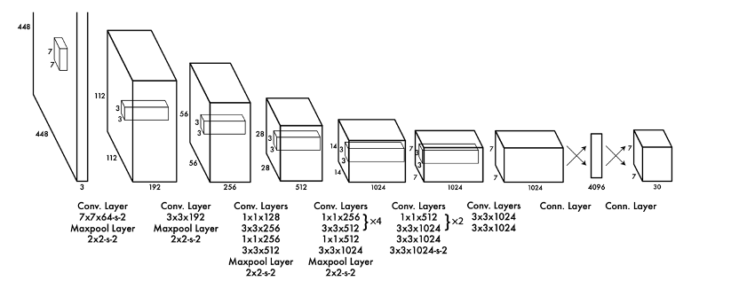
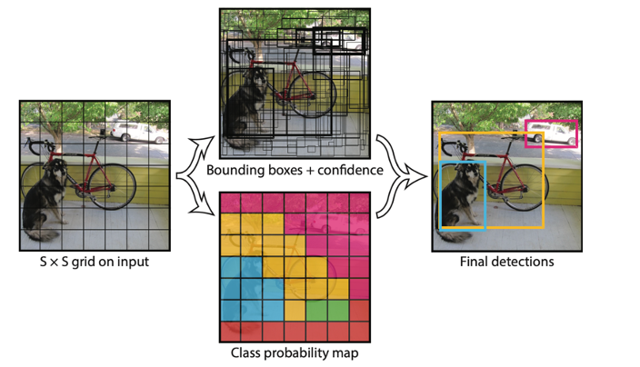
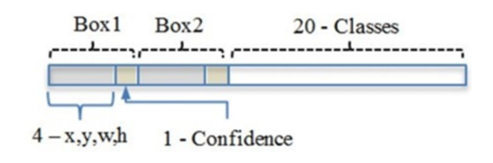
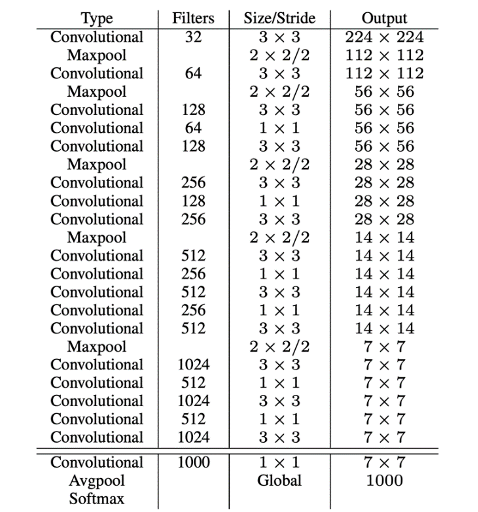
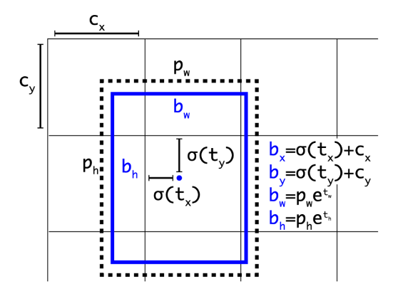
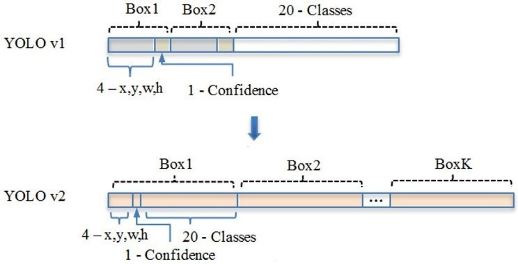
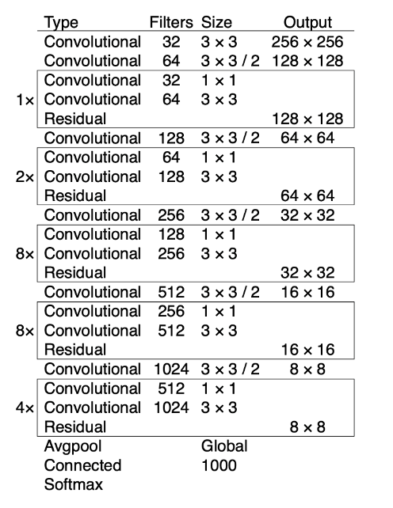
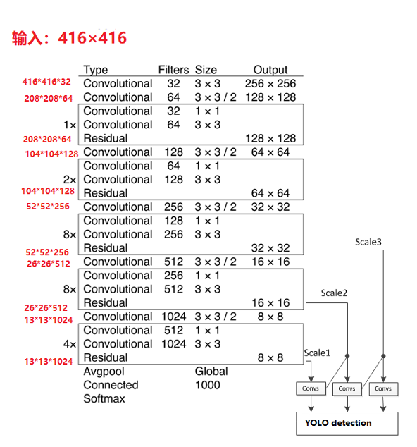

###### [返回主页](../README.md)

------

# 经典目标检测方法：YOLO系列

##  YOLO v1

2016年，Joseph Redmon、Santosh Divvala、Ross Girshick等人提出了一种单阶段的目标检测网络。该方法的检测速度非常快，每秒可以处理45帧图片，能够轻松地实时运行。由于其速度之快和其使用的特殊方法，作者将其取名为：You Only Look Once（也就YOLO的全称），并将该成果发表在了CVPR 2016上，从而引起了广泛地关注。

YOLO的核心思想就是把目标检测转变成一个回归问题，利用整张图作为网络的输入，仅仅经过一个神经网络，得到边界框的位置及其所属的类别。其网络结构如下：

YOLOv1采用的是“分而治之”的策略，将一张图片平均分成7×7个网格，每个网格分别负责预测中心点落在该网格内的目标。与上文提到的两阶段方法不同，例如在Faster R-CNN中，是通过一个RPN来获得目标的感兴趣区域，这种方法精度高，但是需要额外再训练一个RPN网络，这无疑增加了训练的负担。在YOLOv1中，通过划分得到了7×7个网格，这49个网格就相当于是目标的感兴趣区域。YOLO不需要再额外增加一个RPN网络，这也正是该方法简单快捷之处。

该方法首先将一幅图像分成 S*S个网格，如果某个目标的中心落在这个网格中，则这个网格就负责预测这个目标。每个网格要预测 B 个预测框，每个预测框要预测 (x, y, w, h) 和置信度共5个值。每个网格还要预测一个类别信息，共 C 个类别，检测流程如下：

总的来说，S×S 个网格，每个网格要预测 B个预测框，还要预测 C 个类。网络输出就是一个 S × S × (5×B+C) 的向量，输出向量结构如下。在实际实施过程中，YOLOv1把一张图片划分为了7×7个网格，并且每个网格预测2个预测框，20个类别。所以实际上，S=7，B=2，C=20。那么网络输出的尺寸也就是：7×7×30。

YOLO模型的检测速度非常快。标准版本的YOLO可以每秒处理 45 张图像；经过优化的版本每秒可以处理150帧图像。这就意味着 YOLO 可以以小于 25 毫秒延迟，实时地处理视频。但是，YOLO对相互靠近的物体，以及很小的群体检测效果不好，这是因为一个网格只预测了2个框，并且都只属于同一类。

## YOLO v2

2017年，作者Joseph Redmon和Ali Farhadi在YOLOv1的基础上，进行了大量改进，提出了 YOLOv2模型。重点解决YOLOv1召回率和定位精度方面的不足。YOLOv2 是一个先进的目标检测算法，比同时期其它的检测器检测速度更快。除此之外，该网络可以适应多种尺寸的图片输入，并且能在检测精度和速度之间进行很好的权衡。上述YOLOv1模型是利用全连接层直接预测边界框的坐标，而YOLOv2借鉴了Faster R-CNN的思想，引入锚框机制。利用K-means聚类的方法在训练集中聚类计算出更好的Anchor模板，大大提高了算法的召回率。同时结合图像细粒度特征，将浅层特征与深层特征相连，有助于对小尺寸目标的检测。

YOLOv2采用Darknet-19作为特征提取网络，其整体结构如下。Darknet-19采用与VGG网络类似的结构，大量使用了3x3卷积核，并在每层卷积后使用批归一化（BN）进行处理。共计使用19个卷积层，5个池化层。

在YOLOv1中，作者设计了端对端的网路，直接对边界框的位置（x, y, w, h）进行预测。这样做虽然简单，但是由于没有类似R-CNN系列的推荐区域，所以网络在前期训练时非常困难，很难收敛。于是，自YOLOv2开始，引入了锚框机制，希望通过提前筛选得到的具有代表性先验框Anchors，使得网络在训练时更容易收敛。

在 Faster R-CNN 算法中，是通过预测边界框与真实框的位置偏移值，间接得到预测框的位置。这种方式是无约束的，预测的边界框很容易向任何方向偏移。因此，每个位置预测的边界框可以落在图片任何位置，这会导致模型的不稳定性。因此 YOLOv2 在此方法上进行了一点改变：预测边界框中心点相对于该网格左上角坐标 (Cx, Cy)的相对偏移量，同时为了将预测框的中心点约束在当前网格中，使用 sigmoid 函数将 tx , ty 归一化处理，将值约束在0-1，这使得模型训练更稳定。下图为锚框与预测边界框转换示意图，其中蓝色的是要预测的边界框，黑色虚线框是锚框。

YOLOv1 有一个致命的缺陷就是：一张图片被分成7×7的网格，一个网格只能预测一个类，当一个网格中同时出现多个类时，就无法检测出所有类。针对这个问题，YOLOv2做出了相应的改进：首先将YOLOv1网络的全连接层和最后一个池化层去掉，使得最后的卷积层的输出可以有更高的分辨率特征。然后缩减网络，用416×416大小的输入代替原来的448×448，使得网络输出的特征图有奇数大小的宽和高，进而使得每个特征图在划分单元格的时候只有一个中心单元格，因为大的目标一般会占据图像的中心，所以希望用一个中心单元格去预测，而不是4个。YOLOv2通过5个池化层进行下采样，得到的输出是13×13的像素特征。这意味着一张图片被分成了13×13个网格，每个网格有多个锚框来预测5个回归向量，即 tx、ty、tw、th和置信度。为了解决YOLOv1中一个网格只能预测一个类别的问题，YOLOv2为每个预测框设置了独立的类别向量，经过调整后网络输出向量如下图所示。在对YOLOv1模型进行改进后，YOLOv2模型的检测精度大幅提升。

## YOLO v3

2018年，作者 Redmon 又在 YOLOv2 的基础上做了一些改进。特征提取部分采用darknet-53网络结构代替原来的darknet-19，利用特征金字塔网络结构实现了多尺度检测，分类方法使用逻辑回归代替了softmax，在兼顾实时性的同时保证了目标检测的准确性。从YOLOv1到YOLOv3，每一代性能的提升都与特征提取主干网的改进密切相关。相比于 YOLOv2 的 骨干网络，YOLOv3 借助残差网络的思想，将原来的 darknet-19 改进为darknet-53，其整体结构如下图。Darknet-53主要由1\*1和3\*3的卷积层组成，每个卷积层之后包含一个批量归一化层和一个Leaky ReLU激活函数，加入这两个部分的目的是为了防止过拟合。卷积层、批量归一化层以及Leaky ReLU共同组成Darknet-53中的基本卷积单元DBL。因为在Darknet-53中共包含53个这样的DBL，所以称其为Darknet-53。

与Darknet-19对比可知，darknet-53没有采用最大池化层，转而采用步长为2的卷积层进行下采样。而且引入了残差网络的思想，目的是为了让网络可以提取到更深层的特征，同时避免出现梯度消失或爆炸。为了能够预测多尺度的目标，YOLOv3 选择了三种不同尺寸的锚框，同时每种锚框具有三种不同的尺度，一共9种不同大小的锚框。在COCO数据集上选择的9种锚框的尺寸为(10\*13), (16\*30), (33\*23), (30\*61), (62\*45), (59\*119), (116\*90), (156\*198), (373\*326)。

借鉴特征金字塔网的思想，YOLOv3设计了3种不同尺度的网络输出Y1、Y2、Y3，用于预测不同尺度的目标。该方法让每一个尺度网格负责预测3个边界框，且每个边界框可预测80个类。所以网络输出的向量是：N ×N ×[3∗(4 + 1 + 80)]。由下采样次数不同，得到的N不同，Y1、Y2、Y3的尺寸分别为：[13, 13, 255]、[26, 26, 255]、[52, 52, 255]。

YOLOv3在类别预测方面将YOLOv2的单标签分类改进为多标签分类，在网络结构中将YOLOv2中用于分类的softmax层修改为逻辑分类器。在YOLOv2中，算法认定一个目标只从属于一个类别，根据网络输出类别的得分最大值，将其归为某一类。然而在一些复杂的场景中，单一目标可能从属于多个类别。比如在一个交通场景中，某目标的种类既属于汽车也属于卡车，如果用softmax进行分类，softmax会假设这个目标只属于一个类别，这个目标只会被认定为汽车或卡车，这种分类方法就称为单标签分类。如果网络输出认定这个目标既是汽车也是卡车，这就被称为多标签分类。为实现多标签分类就需要用逻辑分类器来对每个类别都进行二分类。逻辑分类器主要用到了sigmoid函数，它可以把输出约束在0到1，如果某一特征图的输出经过该函数处理后的值大于设定阈值，那么就认定该目标框所对应的目标属于该类。
